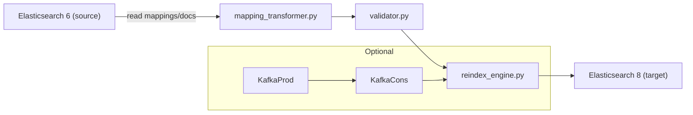

**Elasticsearch Migration**

 

A developer-focused toolkit for migrating indices from Elasticsearch 6 → Elasticsearch 8. This repo contains the transformation, validation, and reindex tooling used to migrate an example index exported from an ES6 cluster on our server and successfully reindexed into ES8.

**TL;DR**: Inspect mappings in ES6, transform types and mappings where needed, then reindex into ES8 with validation and observability.

**Highlights**
- **Purpose:** Make ES6→ES8 migrations safe and repeatable for devs and engineers.
- **Workflow:** Read indices from ES6 → transform mappings/docs → bulk / reindex into ES8.
- **Safety:** Mapping validation, sample-run support, retryable bulk reindexing, and extensive logging.
- **Dev-first:** Examples, local Docker-compose, and a Kafka pipeline for continuous migration testing.

**Quick Start (Dev)**
- Create a virtualenv and install deps:

```bash
python3 -m venv .venv
source .venv/bin/activate
pip install -r requirements.txt
```

- Export or snapshot an index from your ES6 cluster (example was taken from our server). For quick testing you can use the reindex-from-remote API or create a JSONL export for a sample set.

- Run a dev reindex with transform and validation (example):

```bash
# point config.py to your ES6 and ES8 endpoints, then:
python main.py reindex --source-cluster es6.example.local:9200 --target-cluster es8.local:9200 --index example-index --dry-run
```

- Remove `--dry-run` to perform the actual migration after reviewing logs and validation output.

**Files & Key Scripts**
- **Main runner:** [main.py](main.py) — CLI entry for reindexing and other tasks.
- **Mapping transformer:** [mapping_transformer.py](mapping_transformer.py) — mapping diffs, type coercion helpers, and doc transforms.
- **Reindex engine:** [reindex_engine.py](reindex_engine.py) — chunked bulk uploads, backoff, and retry handling.
- **Validator:** [validator.py](validator.py) — sanity checks on mappings and documents.
- **ES client:** [es_client.py](es_client.py) — low-level ES helpers used across scripts.
- **Kafka pipeline:** [kafka-based-migration/](kafka-based-migration/) — optional producer/consumer mode for streaming migration tests.

**Architecture (Dev Flow)**



**Common Commands**
- Quick reindex (dry-run):

```bash
python main.py reindex --source-cluster es6.example.local:9200 --target-cluster es8.local:9200 --index example-index --dry-run
```

- Full reindex with logging to file:

```bash
python main.py reindex --source-cluster es6.example.local:9200 --target-cluster es8.local:9200 --index example-index --log-file migration.log
```

**Tips*
- **Start small:** run transforms on a small subset (`--sample-size 1000`) to validate field coercions.
- **Mappings matter:** ES6 types like `text` vs `keyword` and nested/object changes in ES8 can break indexing — use `mapping_transformer.py` to normalize.
- **Use `--dry-run`:** the tool prints what would change without writing to ES.
- **Monitor cluster health:** large reindexes can cause cluster strain — set bulk sizes and throttle if needed.


